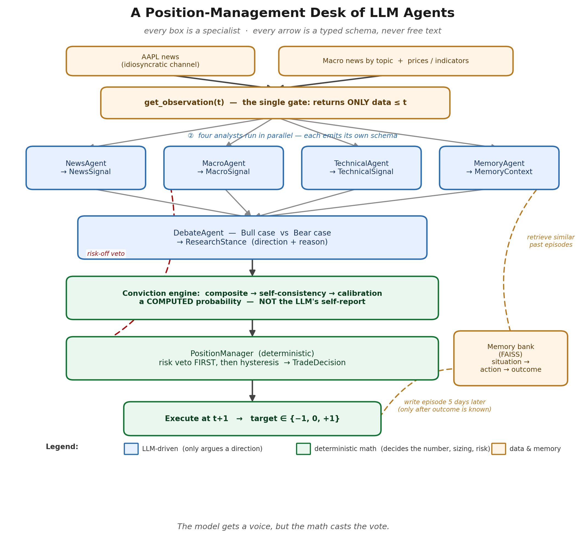
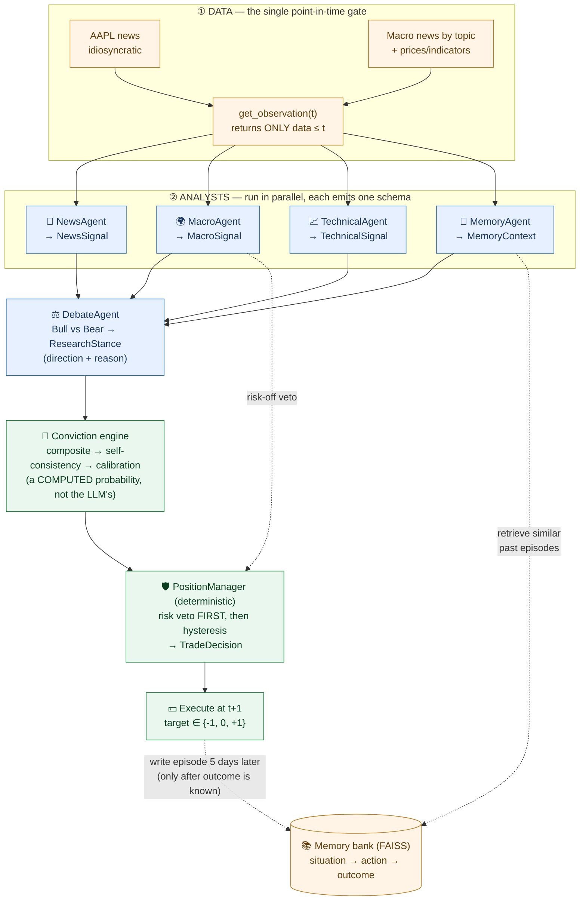
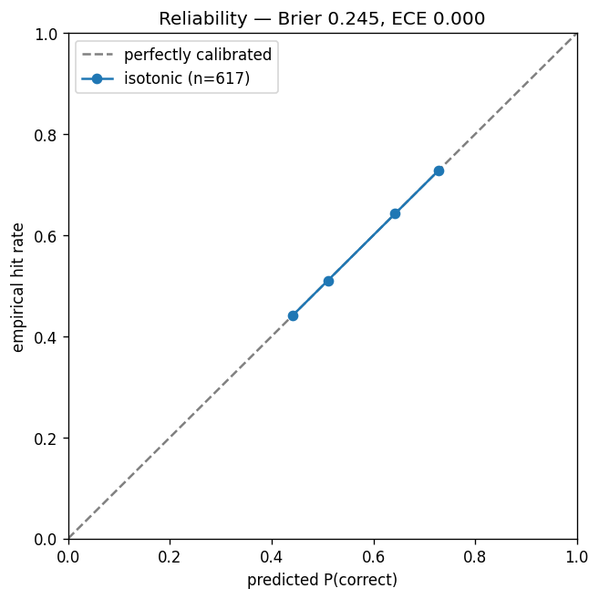
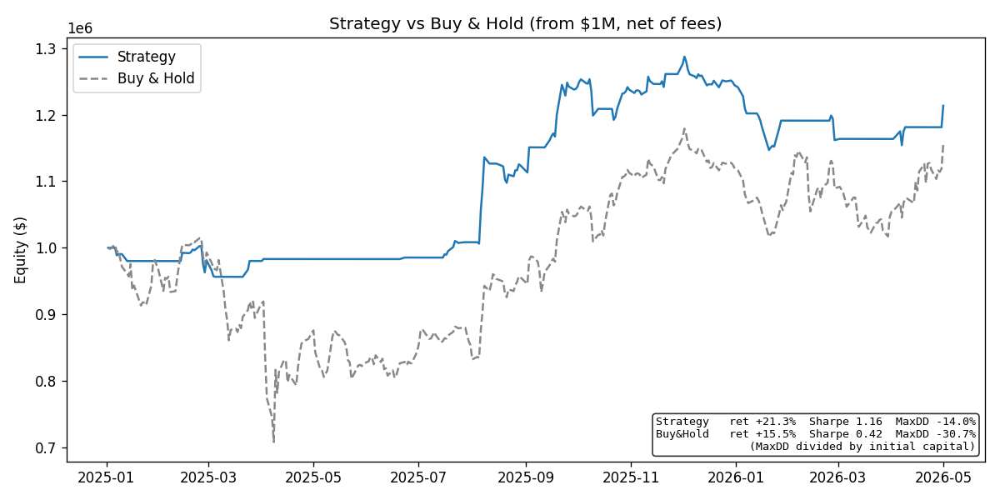

# Multi-Agent LLM Trading System with Calibrated Conviction

### Six LLM agents argue a direction; **calibrated math** decides the trade. A leakage-free, out-of-sample backtest beat buy-and-hold with **nearly 3× the Sharpe and less than half the drawdown** — and every decision is explainable.

---

If you've seen an "LLM trading bot" before, you've probably seen this: a prompt that says *"Here's today's
news, will the stock go up or down tomorrow?"*, a number, and a backtest with a suspiciously smooth equity
curve. It almost never survives contact with reality, and worse, you can't tell *why* it did anything.

This article is about a system built to be the opposite of that. It's a multi-agent LLM that **manages a
position in AAPL** — and the design is organized around one stubborn principle that I'll repeat until it's
annoying:

> **The LLM only gets to supply a direction and a reason. Every number that actually moves money is computed.**

That one rule is what turns an overconfident, hallucination-prone language model into something you can
backtest honestly and even imagine deploying. Let me walk you through *why* each piece exists — because the
intelligence here is in the design decisions, not in any single clever prompt.

---

## 1. First reframe: this is position management, not price prediction

The most important decision was choosing the right problem.

"Will AAPL go up tomorrow?" is a **daily classifier**. It's the wrong problem for three reasons: it churns
(a new guess every day), it has no concept of the trade it's already in, and it can never be held accountable
to a thesis.

So instead, the system manages a **position**. Each day it doesn't predict a price — it chooses an **action**
relative to what it already holds:

- **hold** what you've got,
- **open** a new position,
- **close** the current one, or
- **flip** to the other side,

resolving to a target of **−1 (short), 0 (flat), or +1 (long)**. Crucially, once it's in a trade, it stays in
until the **thesis it entered on is invalidated** — not because today's headline was a little scary.

For a practitioner this reframing pays off immediately: a state-aware policy has **low turnover**, it's
**explainable** ("we're long because of *this* thesis, and it still holds"), and every transition is
**testable**.

---

## 2. The three traps every naive LLM-trading project falls into

The whole architecture is really just a set of answers to three concrete failure modes. Naming them makes the
design legible:

1. **LLMs are confidently wrong.** Ask a model "how sure are you, 0 to 1?" and you get a vibe, not a
   probability. So we never let the LLM's self-reported confidence drive a decision. **We compute conviction.**
2. **Free text is untestable.** If your agents talk to each other in prose, you can't unit-test the handoff,
   you can't diff two runs, and you can't ablate a component. So agents communicate **only through typed
   schemas.**
3. **Look-ahead leakage is the silent killer.** The most common reason a backtest looks brilliant is that the
   future quietly leaked into the past. So the system has exactly **one data gate**, and it's tested.

Keep these three in mind — every section below is "here's how we defused trap #N."

---

## 3. The architecture: an org chart of specialists that speak only in forms

Think of the system as a small investment desk where **nobody is allowed to send an email in free text** —
they can only fill out forms.

Here's a day in the life. Every box is a specialist; every arrow is a **typed form** (a Pydantic schema),
never free text:



*Blue = LLM-driven (it only argues a direction). Green = deterministic math (it decides the number, the
sizing, the risk). Orange = data and memory. That colour split **is** the core idea: the model gets a voice,
but the math casts the vote.*

<details>
<summary>Mermaid source for the diagram above (to edit / regenerate)</summary>


</details>

> 💡 *Embed `results/architecture.png` directly in Medium. The plain-text version below works anywhere:*

```
get_observation(t)                      ← the ONE point-in-time data gate (everything ≤ t)
      │
      ├─► NewsAgent       → NewsSignal        (idiosyncratic AAPL news)
      ├─► MacroAgent      → MacroSignal        (the market regime, by topic) ──┐ risk-off veto
      ├─► TechnicalAgent  → TechnicalSignal    (interprets pre-computed indicators)
      └─► MemoryAgent     → MemoryContext      (similar past situations, from FAISS)
                                  │
                                  ▼
                         DebateAgent  → ResearchStance   (Bull vs Bear → direction + reason)
                                  │
                                  ▼
                    Conviction engine → a COMPUTED probability  (not the LLM's self-report)
                                  │
                                  ▼
                       PositionManager → TradeDecision   (risk veto first, then hysteresis) ◄── veto
                                  │
                                  ▼
              execute at t+1 → target ∈ {-1, 0, +1}; 5 days later, write the episode to memory
```

The contribution isn't any one agent. It's the **protocol**: every arrow above is a **Pydantic schema**, never
a paragraph of text. A message from the technical analyst literally is:

```python
class TechnicalSignal(BaseModel):
    rationale: str                          # one or two sentences — reasons FIRST
    signal: Literal["long", "flat", "short"]
    confidence: float                       # 0..1, defined by a shared rubric
```

Why does typing the messages make the system *intelligent* rather than just tidy? Because it makes the entire
chain of reasoning **inspectable, testable, and ablatable**. I can write a unit test that says "given this
observation, the news agent must return a valid `NewsSignal`." I can delete the memory agent and measure
exactly how much it was contributing. None of that is possible if agents chat in English.

**A design detail I'm proud of: two *separate* news channels.** The NewsAgent reads AAPL-specific news and
filters it for relevance. The MacroAgent reads macro news fetched **by topic** (Fed, rates, geopolitics) and
**never** filters it. Why keep them apart? Because they answer different questions — "is something happening to
*Apple*?" vs. "is something happening to the *whole market*?" — and they feed different parts of the decision.
The macro channel also feeds the **risk veto** (more on that soon). Mix them into one bucket and you lose the
ability to say "the stock is fine, but the market is on fire — stand down."

---

## 4. The cleverest part: conviction is computed, not confessed

This is the heart of the system, so slow down here.

Every decision is gated by a single number, **conviction** — roughly "what's the probability this direction is
right over the next week?" The naive approach is to ask the LLM. We don't, because that number is garbage.
Instead conviction is built in **three layers**, and only the last one produces a real probability.

**Layer 1 — a composite of things you can actually measure.** Not a feeling, but a blend of:
- **Agreement** — among the agents that *took a side*, do they point the same way? (Abstaining agents don't get
  to dilute a confident minority — a subtle but important fix.)
- **Mean confidence** — how confident the agents are on average.
- **Memory consistency** — did similar situations in the past actually work out?

**Layer 2 — self-consistency.** We run the debate **K times at a non-zero temperature** and measure how often
it agrees with *itself*. A model that says "long, long, long, long, hold" is more trustworthy than one that
wavers. Stability is evidence.

**Layer 3 — calibration.** This is where it becomes real. We take the raw score from Layers 1–2 and map it to
an **empirical probability** using isotonic regression, fit *only* on a 2022–2024 warm-up window. After this
step, "conviction = 0.64" actually means "historically, calls this strong were right ~64% of the time."

And here is the result that, to me, justifies the entire project:

> **The LLM's raw directional calls are a coin flip — about 47% accurate.** Useless on their own.
> **But the *computed* conviction sorts them beautifully:** calls at 0.51 conviction were right ~51% of the
> time, at 0.64 → 64%, at 0.73 → 73%. Monotonic. The calibration error (Brier score) dropped from 0.327 to
> 0.245.



Read that twice. The edge is **not** in the LLM's opinion about Apple. The edge is in a system that knows
**when to believe the LLM and when to ignore it.** That's the whole game, and it's a transferable idea: don't
ask your model for a probability — *manufacture* one from measurable signals and calibrate it against reality.

---

## 5. Memory: learning without training

The system's second big idea is **non-parametric learning**. The LLM is **frozen** — we never fine-tune it.
So where does "learning" live? In a **memory bank**.

Every trading day becomes an **episode**: `(the situation → the action taken → the eventual outcome)`. The
situation is embedded into a vector and stored in a FAISS index. On a new day, the MemoryAgent retrieves the
most *similar past situations* and asks, in effect, "last few times it looked like this and we went long, how
did it go?"

The subtle, non-negotiable part is **when** an episode is allowed to exist:

> An episode for day *t* only becomes searchable at **t + 1 + h** (with h = 5 trading days) — i.e. **after its
> outcome is actually known.**

If you wrote the memory the same day, you'd be quietly teaching the system the future. Delaying the write is a
second anti-look-ahead frontier, every bit as important as not reading tomorrow's price.

(One more design choice for the curious: an episode's reward is the **drift-demeaned** forward return — the
stock's move minus its own recent average drift. This stops the system from getting "free credit" for being
long in a market that drifts up anyway, without flipping the long-vs-short boundary the way subtracting the
S&P 500 would.)

The payoff: the system **accumulates experience cheaply and correctly**, with no GPUs and no training loop.

---

## 6. Turning an opinion into a position: a thermostat, not a hair-trigger

Now we have a calibrated conviction and a recommended direction. How does that become an actual trade? Through
the **PositionManager** — which is **deliberately not an LLM**. It's a deterministic rule engine.

This is the clean separation that makes the whole thing trustworthy: **the LLM decides *direction*; math
decides *sizing and timing*.** No language model is ever allowed to hallucinate a position size.

The PositionManager does two things, in order:

**First, it checks the risk veto.** If realized volatility is too high, or the drawdown is too deep, or the
macro regime is "risk-off," or the analysts violently disagree — it forces the position flat, **overriding any
signal**, no matter how confident. Risk control is structurally separated from alpha generation. They are not
allowed to argue.

**Second, if nothing vetoes, it applies asymmetric hysteresis** — think of a **thermostat with a dead-band**:

- **Open** a position only when conviction clears a *high* bar (τ_enter).
- **Close** it only when conviction decays past a *lower* bar (τ_exit).
- **Flip** to the other side only at an *even higher* bar (τ_flip).

That gap between "good enough to enter" and "bad enough to leave" is the **dead-band**, and it's exactly what a
thermostat uses so it doesn't switch the heating on and off every thirty seconds. Here it stops the system from
flapping in and out of trades on noise. The result, as you'll see, is a portfolio that traded only **38 times
in 16 months** and sat flat 61% of the time — by design, not by accident.

---

## 7. Why you can actually believe the backtest

Most "LLM beats the market" posts die on one question from a quant: *"Are you sure there's no look-ahead?"*

This system was built so the answer is "yes, provably," and it comes down to four commitments:

1. **One data gate.** Exactly one function, `get_observation(ticker, t)`, returns data to the rest of the
   system, and it filters everything to **≤ t**. No agent, no backtest loop, nothing else ever touches a raw
   dataframe.
2. **Execution at t+1.** A decision made using day-*t* information is executed at the *next* session's price —
   never the same day's close it just looked at.
3. **Delayed memory.** As above: episodes are written only after their outcome window closes.
4. **A model that can't have memorized the test.** The backbone is **Llama-3.3-70B, whose knowledge ends in
   December 2023**, evaluated on **2025–2026**. It is structurally impossible for it to "remember" what AAPL
   did in the test window.

And it's enforced, not promised: a dedicated test (`test_no_lookahead`) sweeps every day and fails the build if
a single future-dated field ever slips through. Anti-look-ahead is treated as a **first-class invariant**, like
a type check.

---

## 8. The result (January 2025 → 1 May 2026)

Here's how it did over 333 trading days, starting from $1,000,000, **net of fees**, against simply buying and
holding AAPL:

| Metric | **The Agent System** | Buy & Hold AAPL |
|---|---|---|
| **Total return** | **+21.3%** | +15.5% |
| **Sharpe ratio** (return per unit of risk) | **1.16** | 0.42 |
| **Sortino ratio** (downside-risk-adjusted) | **1.28** | — |
| **Max drawdown** (worst peak-to-trough) | **−14.0%** | −30.7% |
| **Trades** | 38 | 1 |
| **Avg. holding period** | ~7 days | — |
| **Time in market** | 39% (flat 61%) | 100% |



The honest summary: **it beat the benchmark on return *and* on risk.** Nearly **3× the Sharpe ratio** and
**less than half the maximum drawdown** — while being in the market only 39% of the time. It sidestepped the
ugliest part of AAPL's ride and compounded selectively, entering only when the calibrated conviction earned it.

That last point is the design showing through. The system didn't win by being a better stock-picker on any
given day (remember: raw calls are a coin flip). It won by **being selective and risk-aware** — exactly the
behavior the architecture was built to produce.

---

## 9. It's a glass box: click any day and ask "why?"

A number in a table is easy to fake. So the project ships an **interactive explainability report** — a single
self-contained HTML file with a clickable equity curve. **Click any day** and a panel shows you the full
reasoning behind that day's decision:

- the **news headlines** it actually read,
- each analyst's **call and one-line rationale** (News / Macro / Technical / Memory),
- the **Bull case, the Bear case**, and whether the entry thesis still held,
- the **conviction** number, and
- the **final decision and the reason for it.**

> 📊 **[Open the interactive report →](results/report.html)** *(insert a screenshot of the panel here when
> publishing — Medium can't embed the live HTML; the file itself opens in any browser, no server needed.)*

For a practitioner this is the difference between a demo and a system. An agent you can **interrogate at the
level of a single decision** is one you can debug, trust, and improve. (It was also, candidly, the single best
debugging tool I built — the first time I clicked through a flat stretch, it was immediately obvious the system
was being *too* shy, which led directly to re-tuning the entry threshold.)

---

## 10. What I'd tell another practitioner

If you take nothing else from this, take the five design rules — they generalize well beyond trading:

1. **Make agents speak in schemas, not prose.** Typed messages are testable, diffable, and ablatable. Free
   text is none of those.
2. **Compute confidence; never trust a self-reported number.** Manufacture a score from measurable signals,
   then **calibrate it against reality**. Knowing *when* to believe your model is worth more than the model's
   opinion.
3. **Separate the creative part from the safety part.** Let the LLM decide *direction*; let deterministic code
   decide *sizing, timing, and risk*. Never let a language model size a position.
4. **Treat anti-look-ahead as a first-class invariant** — one gate, executed at t+1, with a test that fails the
   build. In any system that learns from time-series, leakage is the default outcome unless you engineer it out.
5. **Build the explainability view early.** It's your credibility *and* your debugger.

**An honest word on limits.** Sixteen months is essentially **one market regime**, the reporting endpoint was
chosen deliberately, the calibration is in-sample on the warm-up window, and shorts didn't fire in this period.
I would not bet a fund on this curve. What I *would* stand behind is the **behavior** the design produces —
selective, low-turnover, risk-aware, and fully auditable — and the finding that **a calibrated conviction can
extract signal from an LLM whose raw opinion is a coin flip.**

Because the real takeaway was never "LLMs can trade." It's a **discipline for turning an unreliable reasoner
into a reliable system**: give it a voice, but make the math decide.

---

*Built with LangGraph, a frozen Llama-3.3-70B (via OpenRouter), FAISS for memory, and scikit-learn for
calibration. The agents communicate only through Pydantic schemas; every reported number is point-in-time and
net of fees.*
