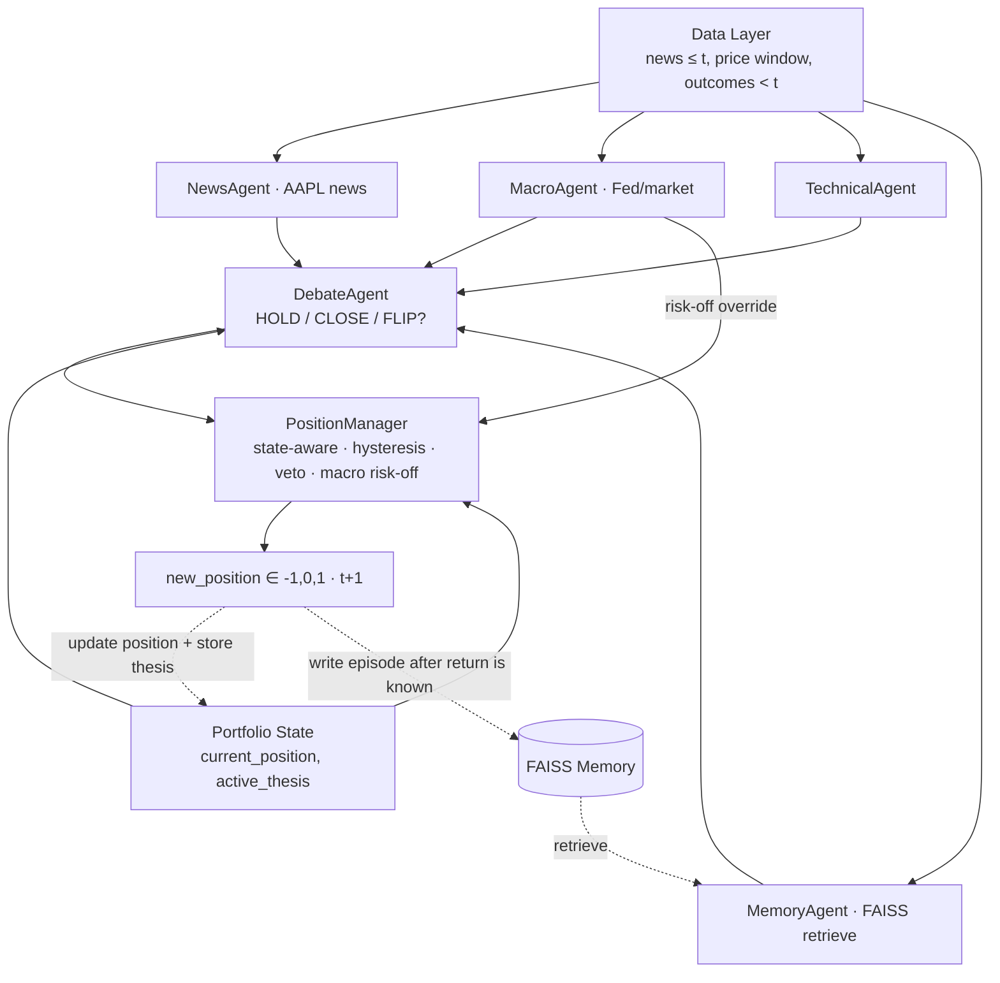

# Multi-Agent LLM Trading System for AAPL
### A multi-agent system that reads news + charts and makes daily trading decisions — the core contribution is the design of the coordination protocol between LLM agents

**Author:** Khai Nguyen — PhD Financial Mathematics, University of Manchester
**Positioning:** Portfolio project for a Quant Research role. The original contribution is the **design of the Agent-to-Agent (A2A) communication protocol** and the **memory mechanism**, *not* training an LLM model.
**Core technology:** LangChain / LangGraph · ChatGroq (Llama 3.3 70B, free) · Alpha Vantage News · FAISS · vectorbt

---

## 1. Objective & scope

**Objective:** Build a multi-agent system that uses LLMs to read, each day, the news + technical indicators for **AAPL**, debate, and **manage a position** — deciding whether to *hold / open / close / flip* the current state. The problem is **NOT** "predict whether tomorrow's candle goes up or down"; it is a **position-management policy**: given current information **and** the position currently held, what is the optimal action → target position ∈ {**−1, 0, 1**}. Evaluated with an **out-of-sample backtest over 2025–2026**, producing a PnL curve compared against baselines.

**Core property — enter a position and HOLD until the thesis is invalidated:**
The system is designed to **enter a position and maintain it across multiple sessions**, closing only when the *reason for entry (thesis) is invalidated* — not flipping the position on daily noise. This reduces turnover, avoids being eaten by transaction costs, and reflects real trading better than a daily up/down classifier.

**Scope (deliberately narrowed to control quality):**
- A single asset: **AAPL** (large-cap, dense news coverage).
- Monitoring frequency: **daily** — run the agents each day `t` to *re-evaluate the position*, executing changes (if any) at session `t+1`. On most days the action is "hold".
- Position: long / flat / short ∈ {−1, 0, 1}, state-aware (the decision depends on the current position too).

**Four research questions:**
1. Does a **risk-controlled debate protocol** between agents improve decision quality versus a single agent?
2. Does **memory** (learning from past experience via retrieval, not training) add alpha?
3. Does a **state-aware policy with thesis-persistence + hysteresis** reduce turnover and improve risk-adjusted return versus a daily classifier?
4. Are the results **robust when swapping the LLM backbone** (proving the value lies in the protocol, not the model)?

---

## 2. Data

### 2.1. Primary sources
| Type | Source | Notes |
|---|---|---|
| **AAPL-specific news (idiosyncratic)** | **Alpha Vantage `NEWS_SENTIMENT&tickers=AAPL`** | Free; each item has `title`, `summary`, `time_published`, `topics`, `ticker_sentiment` (per-ticker relevance + sentiment). |
| **Macro news (systematic)** | **Alpha Vantage `NEWS_SENTIMENT&topics=...`** (`economy_monetary`, `economy_macro`, `financial_markets`) | **Fetched by topic, NOT by ticker** → captures Fed / rates / geopolitics / broad-market news even when AAPL is not mentioned. |
| **Market context** | **SPY** trend; (stretch) AV `FEDERAL_FUNDS_RATE`, `TREASURY_YIELD` | The **beta** channel: macro shocks hit AAPL via the market (AAPL beta ~1.2). |
| **AAPL price** | Alpha Vantage `TIME_SERIES_DAILY_ADJUSTED` (or WRDS/CRSP) | Daily adjusted OHLCV. |

> **Separating the two information channels (a core design point):** AAPL-specific news feeds the *idiosyncratic* part (own alpha); macro news feeds the *systematic* part (market risk via beta). The relevance filter applies only to the AAPL channel; the macro channel goes through a separate path so it is **not filtered out by mistake** — this is precisely how the system covers Fed/Iran news that a ticker-only design would miss.

**Alpha Vantage fields used and their roles:**
- `title` + `summary` → **the text the LLM reads** (not full text; the summary is a publisher-provided abstract).
- `time_published` → **point-in-time lock**: on day `t`, only ingest news with timestamp ≤ the decision time.
- `ticker_sentiment.relevance_score` → **filter / weight** news (drop noise, e.g. relevance < 0.3). *Data hygiene, not a source of alpha.*
- `ticker_sentiment.ticker_sentiment_score` → **NOT used as the primary signal** (otherwise the alpha comes from AV's model, not our agents). Used only as: (a) a baseline to beat, (b) a cross-validation against the LLM-derived sentiment, (c) an "uncertainty" flag when the LLM diverges strongly from AV.

> Technical note: the API returns numbers as strings → the loader casts to `float`; one item may mention multiple tickers → filter the correct AAPL entry inside `ticker_sentiment`. Download once, **cache to Parquet** (free tier 25 requests/day); the backtest reads from cache.

### 2.2. Budget note (all free)
- **LLM:** ChatGroq free tier (30k tokens/min, 14,400 requests/day) — more than enough for the ~5,500 calls of the whole project.
- **News:** Alpha Vantage free — batch download + cache.

---

## 3. Timeline: "learning" and backtest

This is **NOT** gradient training. The LLM is frozen. "Learning from the past" is done via **non-parametric memory** + **prompt/threshold calibration**.

| Phase | Range | Role | Report PnL? |
|---|---|---|---|
| **Memory warm-up** | **2022 – 2024** | Populate FAISS with historical episodes (experience bank); tune prompts, thresholds, k. | ❌ No |
| **Out-of-sample test** | **2025-01 → 2026-06** | Run once, report the official PnL. Memory keeps growing point-in-time. | ✅ Yes |

**Anti-lookahead (critical for credibility):**
- **Pretraining lookahead:** the backbone **Llama 3.3 70B has a knowledge cutoff of Dec 2023**; the 2025–2026 test sits *entirely after* the cutoff → the model cannot "know the future" of the test period. The 2022–2024 warm-up *is within* training data, so **warm-up PnL must not be reported** (used only to populate memory + calibrate).
- **Data lookahead:** day `t` only sees news with `time_published ≤ t` and memory episodes `< t` (expanding window).
- **README commitment:** *"The entire test period (2025–2026) is after the backbone's Dec-2023 knowledge cutoff, eliminating pretraining lookahead. The model version is pinned."*

---

## 4. System architecture

### 4.1. Layers

```
┌─────────────────────────────────────────────────────────────┐
│  L5 · EVALUATION LAYER                                        │
│  vectorbt · baselines · ablation · model-sensitivity         │
├─────────────────────────────────────────────────────────────┤
│  L4 · EXECUTION / BACKTEST LAYER                              │
│  walk-forward loop · position sizing · transaction cost      │
├─────────────────────────────────────────────────────────────┤
│  L3 · ORCHESTRATION / PROTOCOL LAYER   ◀── core contribution  │
│  LangGraph state machine · A2A message schema · debate/veto  │
├───────────────┬───────────────────────────┬─────────────────┤
│  L2 · AGENT LAYER (LLM via ChatGroq)       │  MEMORY LAYER    │
│  News · Macro · Technical · Debate ·       │  FAISS + reflect │
│  PositionManager                           │                  │
├───────────────┴───────────────────────────┴─────────────────┤
│  L1 · DATA LAYER                                            │
│  AAPL news + MACRO news (by topic) · AAPL price + SPY        │
│  Parquet cache · point-in-time · indicators (ta/pandas)      │
└─────────────────────────────────────────────────────────────┘
```

### 4.2. Agent workflow diagram

```
  ┌──────────────────── DATA LAYER (point-in-time, day t) ─────────────────────┐  ┌─ PORTFOLIO STATE ─┐
  │ AAPL news(≤t)   MACRO news by topic(≤t)   price+SPY(t)   outcomes(<t)       │  │ current_position  │
  └──┬──────────────────┬──────────────────┬──────────────────┬───────────────┘  │ active_thesis     │
     ▼                  ▼                  ▼                  ▼                    └────────┬──────────┘
┌──────────┐  ┌──────────────┐  ┌────────────────┐  ┌──────────────┐                       │
│NewsAgent │  │ MacroAgent   │  │TechnicalAgent  │  │ MemoryAgent  │                       │
│AAPL news │  │ Fed/market   │  │ indicators     │  │ retrieve top-k│                       │
│idiosyncr.│  │ regime/risk  │  │                │  │              │                       │
└────┬─────┘  └──────┬───────┘  └───────┬────────┘  └──────┬───────┘                       │
NewsSig│   MacroSignal│    TechnicalSig │     MemoryContext │                                │
       └───────┬──────┴────────┬────────┴─────────┬─────────┘                                │
               ▼               ▼                  ▼                                          │
      ┌──────────────────────────────────────────────────────────────┐                      │
      │   DebateAgent (Bull vs Bear)                                  │◀─────────────────────┤
      │   "Given position {pos} & thesis {thesis}: HOLD/CLOSE/FLIP?"  │       (reads state)   │
      │   → ResearchStance                                           │                      │
      └────────────────────────────┬─────────────────────────────────┘                      │
                                   ▼                  ┌── MacroSignal (risk veto channel) ─┐  │
      ┌──────────────────────────────────────────────────────────────┐                  │  │
      │  PositionManager (state-aware + hysteresis + veto) ◀──────────┼──────────────────┘  │
      │  high entry / low exit thresholds · vol/DD cap · macro risk-off│◀────────────────────┘
      │  → TradeDecision                                             │
      └────────────────────────────┬─────────────────────────────────┘
                                   ▼
             new_position ∈ {−1,0,1} for session t+1  ──► update PORTFOLIO STATE
                                   │                      (store thesis when opening a new position)
     (after return t+1 is known) ──► write episode to FAISS memory
```

**Mermaid version** (if the viewer supports it):



### 4.3. The A2A (Agent-to-Agent) protocol — the core

**Principle:** all agents communicate through **fixed Pydantic schemas**, not arbitrary free text. This turns "agent dialogue" into a **structured, testable, ablatable protocol**.

```python
# Message contracts between agents (abridged)
class PortfolioState(BaseModel):           # ◀── state carried across days
    current_position: Literal[-1, 0, 1]    # position currently held
    active_thesis: str                     # reason for entry (empty if flat)
    entry_price: float | None
    days_held: int

class NewsSignal(BaseModel):
    signal: Literal["long","flat","short"]; confidence: float; sentiment: float; rationale: str
class MacroSignal(BaseModel):              # ◀── systematic / macro channel
    regime: Literal["risk_on","neutral","risk_off"]
    macro_risk: float                      # 0..1, today's systematic risk level
    drivers: list[str]                     # e.g. ["Fed meeting", "Iran tensions"]
    rationale: str
class TechnicalSignal(BaseModel):
    signal: Literal["long","flat","short"]; confidence: float; indicators: dict; rationale: str
class MemoryContext(BaseModel):
    analogs: list[str]      # k similar past situations + outcomes
    lesson: str

class ResearchStance(BaseModel):           # decision RELATIVE to the current position
    action: Literal["hold","open","close","flip"]
    target_direction: Literal[-1, 0, 1]
    conviction: float
    thesis_still_valid: bool               # is the original thesis still valid?
    bull_case: str; bear_case: str

class TradeDecision(BaseModel):
    new_position: Literal[-1, 0, 1]        # position for session t+1
    new_thesis: str                        # updated on open/flip
    vetoed: bool; reason: str
```

**Five protocol properties:**
1. **State-aware policy:** the decision is always *relative to the current position* (`current_position` + `active_thesis` are fed into the DebateAgent and PositionManager). The output is an **action** (hold/open/close/flip), not an absolute daily prediction.
2. **Thesis-persistence:** when a position is opened, the *thesis* is stored in state; each day the system asks **"is the original thesis still valid?"** → close only when the thesis is invalidated, not on price noise.
3. **Hysteresis (asymmetric thresholds):** **entering** requires high conviction (e.g. > 0.7); **exiting** only when conviction drops below a lower threshold (e.g. < 0.4). *Note: `conviction` here is a value quantified & calibrated by a mathematical mechanism, not a number the LLM made up — see Section 7.3.* This "Schmitt-trigger" band produces *hold-across-sessions behavior with lower turnover*.
4. **Structured debate + risk veto:** the DebateAgent must produce both Bull and Bear cases; the PositionManager can **veto / force flat** based on realized vol, drawdown, **macro risk-off regime** (from the MacroAgent), and the level of signal disagreement.
5. **Memory feedback loop:** the episode `(state → action → outcome)` is written after the outcome is known; in later rounds the MemoryAgent retrieves it to provide "experience" — learning without updating weights.

---

## 5. Per-agent details & prompt structure

> Common prompt convention: each agent has **(a) System** defining role + constraints, **(b) Human** injecting point-in-time data, **(c)** enforcing `with_structured_output(Schema)`. All `temperature=0` for reproducibility.

### 5.1. NewsAgent
- **Role:** read the day's news, extract sentiment/events, propose a signal.
- **Input:** `title`, `summary` (relevance-filtered), `ticker`.
- **Output:** `NewsSignal`.
- **Prompt structure:**
  - *System:* "You are a news analyst for {ticker}. **Rely only on the provided news**, do not use outside knowledge or events after the news date. Return signal, confidence (0–1), sentiment (−1..1), and a reason ≤2 sentences."
  - *Human:* `Date: {t}\nNews:\n{title_1} — {summary_1}\n{title_2} — {summary_2}...`
  - *Anti-leak constraint:* emphasize "do not infer based on anything you know about the future."

### 5.2. MacroAgent (systematic / macro channel)
- **Role:** read macro news + market context, assess the **regime** and **systematic risk** — the part affecting AAPL via beta that the NewsAgent (reading only AAPL news) misses.
- **Input:** macro news fetched by `topics` (economy_monetary, economy_macro, financial_markets), SPY trend; (stretch) Fed funds/treasury yield change. All point-in-time ≤ `t`.
- **Output:** `MacroSignal` (regime ∈ {risk_on, neutral, risk_off}, `macro_risk` 0–1, `drivers`, rationale).
- **Prompt structure:**
  - *System:* "You are a macro strategist. Based on macro news and market context up to day {t}, assess whether the environment is risk-on/neutral/risk-off and the systematic risk level (0–1). State the main drivers (Fed, rates, geopolitics...). **Do not** form a view on AAPL specifically here — only the general context."
  - *Human:* `Macro news:\n{macro_headlines}\nSPY trend: {spy_trend}, rates: {rate_chg}`
  - *Routing:* `MacroSignal` goes to the **DebateAgent** (context view) and especially to the **PositionManager** as a **risk-off veto channel**.

### 5.3. TechnicalAgent
- **Role:** interpret technical indicators into a signal.
- **Input:** indicators **precomputed with `ta`/pandas** (deterministic): RSI(14), MACD, MA20/50, 20d realized vol, momentum.
- **Output:** `TechnicalSignal`.
- **Prompt structure:**
  - *System:* "You are a technical analyst. Below are the precomputed indicators for {ticker} up to day {t}. **Do not make up numbers**; only interpret them. Return signal, confidence, and a reason."
  - *Human:* `RSI={rsi}, MACD={macd}, MA20={ma20}, MA50={ma50}, vol20={vol}, mom={mom}`
  - *Why separate number-crunching from the LLM:* avoid numeric hallucination, ensure reproducibility.

### 5.4. MemoryAgent
- **Role:** provide "experience" from the past.
- **Mechanism:** embed (news + market state) for day `t` → retrieve the **top-k most similar episodes** from FAISS (only episodes `< t`) → summarize the lesson.
- **Output:** `MemoryContext`.
- **Prompt structure:**
  - *System:* "Below are {k} similar past situations with the action taken and the **actual outcome**. Summarize a short lesson to support today's decision. Do not reveal/assume information after day {t}."
  - *Human:* `Today's situation: {today_state}\nPrecedents:\n- {analog_1} → return {r1}\n- {analog_2} → return {r2}...`

### 5.5. DebateAgent (Bull/Bear) — state-aware
- **Role:** fuse the sources via debate, **considering the current position**, to recommend hold/close/flip.
- **Input:** `NewsSignal`, `MacroSignal`, `TechnicalSignal`, `MemoryContext`, **`PortfolioState`** (current position + thesis).
- **Output:** `ResearchStance` (action + target_direction + conviction + `thesis_still_valid`).
- **Prompt structure:**
  - *System:* "You moderate a position-management debate. The current position is **{current_position}** with the thesis: *{active_thesis}* (held for {days_held} sessions). **Step 1** write the strongest Bull case. **Step 2** write the strongest Bear case. **Step 3** answer: *is the original thesis STILL valid?* **Step 4** recommend an action ∈ {hold, open, close, flip} + conviction (0–1). If a position is held and the thesis still holds, prefer **hold** unless there is clear contradicting evidence."
  - *Human:* inject `PortfolioState` + the input schemas as labeled text.
  - *Purpose:* force the agent to *defend the held position* unless the thesis is invalidated → avoid flipping on noise.

### 5.6. PositionManager (replaces RiskAgent) — state-aware + hysteresis + veto
- **Role:** translate the recommendation into a **position state transition**, apply hysteresis and risk control, make the final decision.
- **Input:** `ResearchStance`, `PortfolioState`, `MacroSignal` (regime/macro_risk), realized vol, current drawdown, disagreement level (LLM-sentiment vs AV-sentiment).
- **Output:** `TradeDecision` (`new_position` ∈ {−1,0,1} + `new_thesis` + veto flag).
- **Hysteresis logic (asymmetric thresholds):**
  - Currently **flat** → only **open** when `conviction ≥ τ_enter` (e.g. 0.7).
  - Currently **in a position** → only **close** when `thesis_still_valid = False` **or** `conviction ≤ τ_exit` (e.g. 0.4).
  - **Flip** only when the opposite signal is *very strong* (`conviction ≥ τ_flip`, e.g. 0.8).
- **Prompt structure:**
  - *System:* "You are a portfolio/risk manager. Current position {current_position}. Apply the hysteresis rules: entering requires conviction ≥ {τ_enter}, exit when the thesis is invalidated or conviction ≤ {τ_exit}, flip requires ≥ {τ_flip}. **Force flat / reduce size** if realized vol > {vol_cap}, or drawdown < {dd_cap}, or **regime = risk_off / high macro_risk**, or high signal disagreement. Return new_position, update the thesis on open/flip, and explain."
  - *Human:* `Action={action}, conviction={conv}, thesis_valid={valid}, pos={pos}, regime={regime}, macro_risk={mrisk}, vol={vol}, dd={dd}, disagreement={disg}`
  - *Lightweight option (if short on time):* implement hysteresis + vol cap as a **deterministic rule** instead of an LLM — still preserving the hold & veto behavior.

---

## 6. Trading strategy & backtest

- **Nature:** this is a **position-management policy**, not a fresh buy/sell signal each day. Each day `t` the system *re-evaluates* the held position and changes only when needed.
- **Output:** `new_position` ∈ {−1, 0, 1} applied to the **return of session t+1** (avoid execution lookahead). `1` = long, `0` = flat (cash), `−1` = short.
- **Holding:** thanks to hysteresis + thesis-persistence, the position is **held across multiple sessions**; an actual trade occurs only when `new_position ≠ current_position`.
- **Transaction cost:** charge ~5–10 bps each time the position *changes* (penalize churn → reward sensible holding).
- **Backtest engine:** **vectorbt** computes the equity curve, Sharpe, Sortino, MaxDD, **turnover**, **average holding period**.
- **Walk-forward:** step sequentially through 2025–2026 carrying `PortfolioState`; after each day, write an episode to memory (expanding window).
- **Cache:** store LLM output by `(date, agent)` so re-running ablations costs no new calls.

---

## 7. Learning mechanism: non-parametric memory vs RL

**This system does NOT use RL/gradients.** The LLM is frozen, weights never change. "Learning" happens in the **external memory (FAISS)** — the episode database grows over time; behavior changes because the *input (retrieved memory) changes*, not because the model changes.

| | RL (gradient) | Memory-augmented frozen LLM (this system) |
|---|---|---|
| Where experience lives | weights θ | external episode DB |
| Update mechanism | backprop on reward | append episode + retrieval |
| Use of reward | drives gradient | stored as fact, re-read in-context |
| Optimization guarantee | Yes | No (heuristic conditioning) |
| Credit assignment | explicit (TD/discount) | implicit (LLM infers) |
| Data hunger | high | low (few-shot) |
| Interpretability | low | high (see episodes + rationale) |

**Three "experience" channels:** (1) *retrieval-conditioned generation* — on a similar situation, pull the old episode with its outcome into context → the LLM leans toward avoiding the previously losing action; (2) the LLM is a *fixed reasoning engine*, policy = engine + variable memory; (3) optional *reflection* — distill episodes into text "lessons".

> Honesty (state in README): this is adaptation from experience, **but it does not optimize a reward objective** and **has no explicit credit assignment**. The trade-off: no training, data-efficient, interpretable.

### 7.1. Forward return / reward definition for memory

Distinguish two returns: **(A) Backtest PnL** = daily mark-to-market of the actual position, net of fees, *no window needed*. **(B) Forward return** = the "reward" attached to an episode for the LLM to re-read — *needs a window h*.

**Formula (B), entering at `t+1` to avoid lookahead, h = 5 sessions:**

```
forward_return(t, h) = P[t+1+h] / P[t+1] − 1        # h = 5
```

**Use ABNORMAL return as the reward (not raw):** avoid a rising market making "always long is right".

```
reward(t, h) = sign(action) × ( forward_return(t, h) − benchmark_return(t, h) )
# benchmark = buy & hold AAPL; sign(action): long=+1, short=−1, flat=0
```

→ the reward measures **decision skill**, not market drift (event-study / abnormal-return spirit).

**Delayed-write rule to prevent leakage (mandatory):** at `t` we do not know `forward_return(t,h)`. The episode for day `t` is **written to memory only at `t+1+h`** (when the window closes). When the backtest reaches `t'`, only episodes whose outcome has closed (`t+1+h ≤ t'`) can be retrieved. Writing earlier = leakage.

**Window:** default **h = 5 sessions** (≈ 1 week — matches the news-decay horizon and swing holding). Test sensitivity `h ∈ {1, 5, 10, 21}` as a robustness item.

### 7.2. (Optional) Reward-based threshold tuning — a bridge to RL
Keep the LLM frozen, but **optimize the thresholds `τ_enter`, `τ_exit`, `τ_flip`, `vol_cap`** on the calibration set against a reward objective (Sharpe) — grid search / Bayesian optimization. This is a *real* reward-driven component sitting outside the LLM, without breaking the "design the protocol, don't train the model" thesis.

### 7.3. Quantifying & calibrating conviction (do NOT let the LLM make up the number)

**Principle:** the entry/exit thresholds must be based on a number with a *mathematical mechanism*, not the LLM's self-reported confidence (LLMs are notoriously overconfident and inconsistent). Conviction is built in 3 layers:

**Layer 1 — Composite conviction from measurable signals.**
Instead of trusting a single number, aggregate from observable quantities of the agents:

```
conviction_raw = w1·agreement + w2·mean_confidence + w3·memory_consistency

  agreement          = |Σ_i s_i·c_i| / Σ_i c_i        # s_i ∈ {−1,0,+1} direction, c_i agent i confidence
                                                        # = 1 when agents are in perfect agreement
  mean_confidence    = (1/N) Σ_i c_i                   # average strength
  memory_consistency = #(analogs whose abnormal-return supports the action) / k
  (w1, w2, w3 normalized, Σw = 1; tuned on the calibration set)
```

→ each component is a *quantifiable* quantity, not the model's "gut feeling".

**Layer 2 — Self-consistency sampling (turn a fuzzy judgment into a frequency).**
Run the DebateAgent **K times** with `temperature > 0`; conviction by frequency:

```
conviction_sc = #(runs producing the majority action) / K        # 5/5 → 1.0 ; 3/5 → 0.6
```

This is a standard LLM calibration technique. Cost grows K× in calls — Groq free (14,400 req/day) handles it easily.

**Layer 3 — Calibrate into a true probability (the core step).**
Combine the raw signals `z = α·conviction_raw + β·conviction_sc`, then **map z → empirical probability of being correct** on the 2022–2024 calibration set:

```
P(correct | z) = isotonic_regression(z, hit)      # or Platt scaling (logistic)
conviction     = P(correct | z)                    # final number, with a probability meaning
```

Validate with a **reliability diagram**: after calibration, when the system says conviction = 0.7 the actual hit rate should be ≈ 70%. Only then does `τ_enter = 0.7` *truly* mean "threshold of P(correct) ≥ 70%".

**Closing the loop with hysteresis & reward-tuning:** the thresholds `τ_enter / τ_exit / τ_flip` are set on the *calibrated* `conviction`; the thresholds themselves are optimized against reward (Sharpe) in Section 7.2.

> Mechanism summary: **(aggregate quantifiable signals) → (self-consistency frequency) → (isotonic/Platt calibration into a probability)**. The LLM only provides direction + reasoning; *the decision number comes from mathematics, not from the LLM's self-report*.

---

## 8. Evaluation

**Baselines (so the PnL curve is meaningful):**
1. Buy & Hold AAPL.
2. Single-agent (NewsAgent only).
3. **Pure AV-sentiment** (trade on `ticker_sentiment_score`) — the baseline to *beat*.

**Ablations (prove each part's contribution):**
- Full vs **stateless daily classifier** (remove `PortfolioState` + hysteresis, emit a fresh position each day) — proves the *position-management* framing wins on turnover & risk-adjusted return.
- Full vs **no-memory** (the central ablation).
- Full vs **no-macro** (remove the MacroAgent) — measure the macro channel's value, especially around Fed days / geopolitical events.
- Full vs no-debate (remove Bull/Bear).
- Full vs no-hysteresis (keep state but τ_enter = τ_exit).

**Model-sensitivity / robustness-to-backbone:**
- Re-run on Llama 3.3 70B vs gpt-4o-mini (both cutoffs < 2025 → still post-cutoff for the test).
- Results stable across backbones ⇒ evidence that *the value lies in the protocol, not the model*.

**Metrics:** Cumulative return, Sharpe, Sortino, Max Drawdown, hit rate, **turnover**, **average holding period** (the average number of sessions a position is held — a direct measure of "hold, don't flip on noise" behavior). Plus validation: correlation between the LLM-derived sentiment and the AV score.

---

## 9. Architectural novelty + supporting papers

| Novelty | Description | Supporting paper |
|---|---|---|
| **State-aware position-management policy** | The problem is framed as *hold/open/close/flip* based on the current position + thesis with hysteresis, holding across sessions — **not** a daily up/down classifier. Lower turnover, closer to real trading. | Own contribution; analogous framing to RL-based trading (state + action policy) |
| **Idiosyncratic vs systematic channel separation** | NewsAgent (AAPL-specific news) + MacroAgent (Fed/market) reflect the *own-alpha vs market-beta* split of factor models; macro acts as a **risk-off override** for Fed/geopolitical shocks. | **TradingAgents** (multi-analyst); factor-model thinking |
| **Structured debate protocol** | Mandatory Bull/Bear + fixed schemas across analyst → researcher → trader, simulating a trading firm. | **TradingAgents** (Xiao et al., arXiv 2412.20138) |
| **Risk veto layer** | An agent with veto power based on vol/drawdown/disagreement — risk control separated from signal generation. | **TradingAgents** (risk team); **FinCon** (manager-analyst, risk control) |
| **Non-parametric memory feedback** | Learning from experience via episode retrieval, no weight updates; layered memory by relevance/recency. | **FinMem** (memory-augmented agent); **FinCon** (conceptual verbal reinforcement) |
| **Explainable decisions** | Each agent emits a `rationale`; the final decision is traceable. | **SEP** (Koa et al., arXiv 2402.03659 — self-reflective, explainable) |
| **Post-cutoff evaluation + beat AV baseline** | Test entirely after the knowledge cutoff to remove pretraining lookahead; beat a commercial sentiment baseline. | Methodology survey: **LLM Agents in Financial Trading: A Survey** (Ding et al., arXiv 2408.06361) |

**Differences from the original papers (the project's contribution):**
- **Reframing the problem** from "predict tomorrow's direction" to a **state-aware position-management policy** (hold/open/close/flip + hysteresis + thesis-persistence) — most LLM-trading frameworks still make a stateless decision each day; this is a clear difference and a quantifiable ablation.
- TradingAgents uses many tickers + strong models; here we **isolate a single ticker** to *cleanly* evaluate each agent's contribution, and **swap the backbone for a free LLM** to test robustness — shifting the focus from "model" to "protocol".
- Add a **validation/baseline layer using a commercial sentiment signal (AV)** that the papers lack.
- Emphasize **two-layer anti-lookahead discipline** (data + pretraining) as a top design criterion.

---

## 10. Technology & repo structure

**Stack:** LangChain/LangGraph (orchestration) · ChatGroq Llama 3.3 70B (LLM, free) · Pydantic (A2A schema) · FAISS + sentence-transformers (memory) · `ta`/pandas (indicators) · vectorbt (backtest).

> **Official repo structure: see Section 13.4** (the complete version — with `src/`, `config.py`, `.env`, `llm.py`, `position_manager.py`, `fixtures/`). That is the **single source of truth**; any earlier directory-tree sketch is superseded. The README must include the anti-lookahead commitment + pinned model version (Section 3).

---

## 11. Limitations (state clearly in the README — this honesty earns credit)

- A single asset (AAPL) → no cross-sectional generalization.
- News is only `title + summary` (no full text); the summary is publisher-provided.
- `relevance_score` is computed by AV's (proprietary) model — used as a filter, with a note; optionally add a self-computed relevance as a robustness check.
- ~18-month test → dependent on a single market regime; read the Sharpe with caution.
- LLM cost/speed limit the number of debate rounds (kept to 1).

---

## 12. Implementation principles (MANDATORY — for Claude Code to read before coding)

> These are technical constraints. Prioritize compliance over adding features. When in doubt, choose the option that is *simple, point-in-time, and configurable by ticker*.

### 12.1. NO look-ahead bias (priority #1)
- **A single data gate** `get_observation(ticker, t)` returns only data with timestamp **≤ t**: news (`time_published ≤ t`), price/indicators computed over the window **up to and including t**, SPY/macro ≤ t. No other function may touch the full dataframe directly.
- **Execute at `t+1`**, not `t`: the day-`t` signal applies to the next session's return.
- **Delayed memory write**: the day-`t` episode enters FAISS only at `t+1+h` (h=5); retrieval only pulls closed episodes (`t+1+h ≤ current_t`).
- **Technical indicators** use data up to `t` (be careful that rolling functions don't pull the future; no `shift(-1)`).
- **Phase separation**: do NOT report warm-up PnL (2022–2024); report only the 2025–2026 test.
- **Must have** `tests/test_no_lookahead.py`: assert that every observation at `t` contains no data > `t`.

### 12.2. Use LangChain properly
- Each agent is an **LCEL runnable**: `prompt | llm.with_structured_output(Schema)`. **Do not** hand-parse JSON.
- Every agent's output is forced into a **Pydantic schema** (defined in Section 4.3).
- Use **LangGraph** for orchestration + carrying `PortfolioState` across days.
- The LLM is instantiated in **one single place** (factory) so the provider/model can be swapped in one line (ChatGroq → ChatOpenAI).
- Prompts via `ChatPromptTemplate`, parameterized (ticker, thresholds, ... are parameters).

### 12.3. NO over-engineering (YAGNI)
- Build a **working MVP first**: 1 ticker, 1 debate round, deterministic indicators. Optimize/generalize later.
- **Do not** build: microservices, a database server, a web UI, live trading, a complex config system. A single `config.py`/`.yaml` is enough.
- Don't create "just-in-case" abstractions for things not yet needed. Simple functions beat deep class hierarchies.
- Avoid heavy dependencies; prefer the chosen libraries (LangChain, FAISS, vectorbt, pandas/ta).

### 12.4. Use classes reasonably (just-enough OOP)
- **Use classes where they add clarity:** `BaseAgent` (interface `run(state) -> Signal`) + each agent subclasses it; `PortfolioState`, `Config` (use `@dataclass`/`pydantic`); `MemoryStore` (wraps FAISS); `Backtester`.
- **Do not class-ify** trivial things (a 3-line helper stays a function). Balance against 12.3 — classes are for *reducing duplication & clarifying interfaces*, not for showing off architecture.

### 12.5. Code must be dynamic by ticker (switching AAPL → AMZN without rewriting the system)
- **`ticker` is a config parameter, NOT hardcoded.** A single source of truth: `config.ticker`. No `"AAPL"` strings scattered through the code.
- Every component takes `ticker`: loaders, agents, prompts (`"You are an analyst for {ticker}"`), cache keys, file paths (`data/{ticker}_news.parquet`).
- The benchmark (SPY) and other parameters also live in config.
- **Acceptance criterion:** setting `config.ticker = "AMZN"` → re-run the whole pipeline and get results, **with no other line changed**.

### 12.6. Supporting (lightweight, not violating 12.3)
- **Reproducible:** `temperature=0` for decision agents, pin the model version, fix the seed.
- **Cache:** store LLM output by key `(ticker, date, agent)` and embeddings by `(ticker, date)` → re-run ablations without spending on API.
- **Traceable:** log each day's decision (the signals + rationale + new_position) to a file for review.

---

## 13. Execution contract for Claude Code (Part A)

### 13.1. Definition of Done (whole project)
The project is DONE when:
1. **End-to-end flow:** the pipeline runs with a single command, no errors, from loading data → the agents → the backtest.
2. **Backtest produces correct results, WITH fees:** transaction cost is applied on each position change over the 2025–2026 test period.
3. **Outputs a PnL / equity curve** + a metrics table (Sharpe, MaxDD, turnover, avg holding period) compared against the buy & hold baseline.
4. **Anti-lookahead:** `tests/test_no_lookahead.py` is green.

### 13.2. Milestone roadmap (each milestone leaves a runnable output + acceptance test)
| Milestone | What to build | Acceptance (DoD) |
|---|---|---|
| **M0 · Setup** | repo skeleton, `config`, `.env`, `requirements.txt` | `pip install` succeeds; `python -m src.main --help` runs |
| **M1 · Data layer** | loaders (AAPL news + macro + price + SPY), Parquet cache, `get_observation` | `test_no_lookahead` green; can print one day's observation |
| **M2 · Agents** | News/Macro/Technical/Memory/Debate/PositionManager (LCEL + schema) | smoke test: each agent returns the correct Pydantic schema on one day |
| **M3 · Graph + State** | LangGraph wiring of agents, `PortfolioState` across days, FAISS write/retrieve (delayed by h) | running one day yields a `TradeDecision`; memory writes/reads point-in-time |
| **M4 · Backtest** | walk-forward 2025–2026, fees, vectorbt | produces equity curve + metrics; **PnL net of fees** |
| **M5 · Eval** | baselines + ablation + conviction calibration | comparison table + reliability diagram |

> Rule: complete **sequentially**, a later milestone starts only after the previous one passes acceptance. Each milestone must leave something runnable.

### 13.3. Centralized parameters (config) — Claude Code chooses defaults & tunes
All "knobs" live in **`config.py`** (or `config.yaml`), NOT scattered through the code. Claude Code **proposes sensible starting values from domain knowledge**, then **tunes them on the 2022–2024 calibration set** — no hardcoded numbers inside the logic. Required knobs:

| Group | Parameters | Meaning |
|---|---|---|
| Asset/dates | `ticker`, `benchmark` (SPY), `warmup_start/end`, `test_start/end` | single source of truth |
| Data | `relevance_cutoff`, `max_news_per_day`, `macro_topics` | filtering/limiting news |
| Memory | `h` (forward window), `k` (top-k), `embedding_model` | |
| Hysteresis | `tau_enter`, `tau_exit`, `tau_flip` | enter/exit/flip thresholds (on calibrated conviction) |
| Risk | `vol_cap`, `dd_cap` | veto thresholds |
| Conviction | `K` (self-consistency), `w1,w2,w3`, `alpha,beta` | aggregation weights |
| Backtest | `fee_bps`, `allow_short` | |
| LLM | `model_id`, `temperature`, `provider` | pinned for reproducibility |

> Spirit: *config is the only place that holds numbers; the agent picks defaults by domain knowledge then tunes them, never fabricating numbers scattered around.*

### 13.4. Setup / run spec (with a place for env + run commands)
The repo tree adds a place for keys & config (updated from Section 10; `risk_agent.py` → `position_manager.py`):

```
llm-trading-agents/
├── .env.example          # template: GROQ_API_KEY= , ALPHAVANTAGE_API_KEY=
├── .env                  # (gitignored) your real keys
├── config.py             # all parameters from 13.3
├── requirements.txt      # pinned versions
├── src/
│   ├── main.py           # entrypoint: python -m src.main --mode backtest
│   ├── llm.py            # factory creating ChatGroq (swap provider in one place)
│   ├── data/loaders.py
│   ├── agents/{news,macro,technical,memory,debate,position_manager}.py
│   ├── graph/build_graph.py
│   ├── memory/store.py   # wraps FAISS (point-in-time write/retrieve)
│   ├── backtest/run_backtest.py
│   └── eval/{ablation,calibration}.py
├── fixtures/             # small sample data for offline mode + tests (see 13.6)
├── tests/test_no_lookahead.py
└── notebooks/results.ipynb
```

**Env vars** (read from `.env`, NOT committed; `.env.example` is committed): `GROQ_API_KEY`, `ALPHAVANTAGE_API_KEY`.

**Run commands:**
```bash
cp .env.example .env                  # then fill in your keys
pip install -r requirements.txt
python -m src.main --mode download    # download + cache data once (Parquet)
python -m src.main --mode backtest    # run the 2025–2026 backtest → equity curve
pytest tests/                         # check no-lookahead
```

### 13.5. Data-layer interface contract (point-in-time)

The whole system touches data **through a single gate** that returns an object with a fixed shape. Agents depend on this *contract*, not on how loading works — switching sources (AV → WRDS) changes only the loader, agents untouched. This gate is also the **single point** enforcing point-in-time.

```python
from dataclasses import dataclass

@dataclass
class Observation:                  # every field is ≤ t (already point-in-time)
    ticker: str
    t: "date"
    aapl_news: list[dict]           # [{title, summary, time_published, relevance, av_sentiment}]
    macro_news: list[dict]          # macro news by topic (not ticker-tagged)
    indicators: dict                # {rsi, macd, ma20, ma50, vol20, mom} computed up to t
    price: float                    # close at t (for valuation; execution at t+1)
    spy_trend: float                # SPY trend up to t
    rate_change: float | None       # (stretch) Fed funds/treasury change

# THE SINGLE GATE — only this function returns data to the rest of the system
def get_observation(ticker: str, t) -> Observation: ...
    # Invariant: NO field contains data with timestamp > t.

# Internal loaders (called only by get_observation; nobody else touches the full dataframe)
def load_news(ticker, t) -> list[dict]: ...          # time_published ≤ t
def load_macro_news(topics, t) -> list[dict]: ...    # time_published ≤ t
def load_prices(ticker, until_t) -> "DataFrame": ...  # up to and including t
def compute_indicators(prices_until_t) -> dict: ...   # no shift(-1)
```

**Rule:** no function/agent may read the full dataframe directly; everything goes through `get_observation`. `test_no_lookahead` only needs to check one invariant: for every `t`, `get_observation(ticker, t)` contains no timestamp > `t`.

### 13.6. Offline mode + fixtures (for cheap, deterministic build & test)

Goal: Claude Code can run *both the pipeline and the tests* **without API keys, without spending money, without network**, and get reproducible results — the condition for self-verifying each milestone.

- **Config flag `offline: bool`.** When `offline=True`:
  - **MockLLM** replaces ChatGroq: returns a fixed `Signal`/schema (read from a fixture) instead of calling the real LLM.
  - **Loaders read from `fixtures/`** instead of calling Alpha Vantage.
- **`fixtures/`** holds small, fixed sample data committed to the repo:

```
fixtures/
├── AAPL_news_sample.json      # ~10 items with time_published
├── macro_news_sample.json     # ~10 macro items
├── prices_sample.csv          # ~40 sessions of OHLCV + SPY
└── llm_responses.json         # canned LLM responses for MockLLM
```

- **Where used:**
  - `test_no_lookahead.py` and the M1–M3 smoke tests run fully offline on fixtures → fast, free, deterministic.
  - When `offline=False` (the default for the real M4 backtest): use AV + ChatGroq + Parquet cache.
- **Unified factory:** `llm.py` returns `MockLLM` or `ChatGroq` depending on `config.offline`; the loader also branches on this flag — the rest of the system *does not know* which mode it is in (it still only sees `Observation` + schemas).

> Add `fixtures/` to the repo tree in 13.4. Principle: *everything expensive/changeable (LLM, API) has a mock; every core test runs offline.*

---

## 14. References

1. Xiao, Sun, Luo, Wang. *TradingAgents: Multi-Agents LLM Financial Trading Framework.* arXiv:2412.20138.
2. Koa, Ma, Ng, Chua. *Learning to Generate Explainable Stock Predictions using Self-Reflective LLMs (SEP).* arXiv:2402.03659.
3. Ding et al. *Large Language Model Agent in Financial Trading: A Survey.* arXiv:2408.06361.
4. **FinMem** — memory-augmented LLM trading agent (analysis in the project folder: `FinMem_Framework_Analysis.html`).
5. **FinCon** — multi-agent with conceptual verbal reinforcement & risk control (analysis in the project folder: `FinCon_Framework_Analysis.html`).
